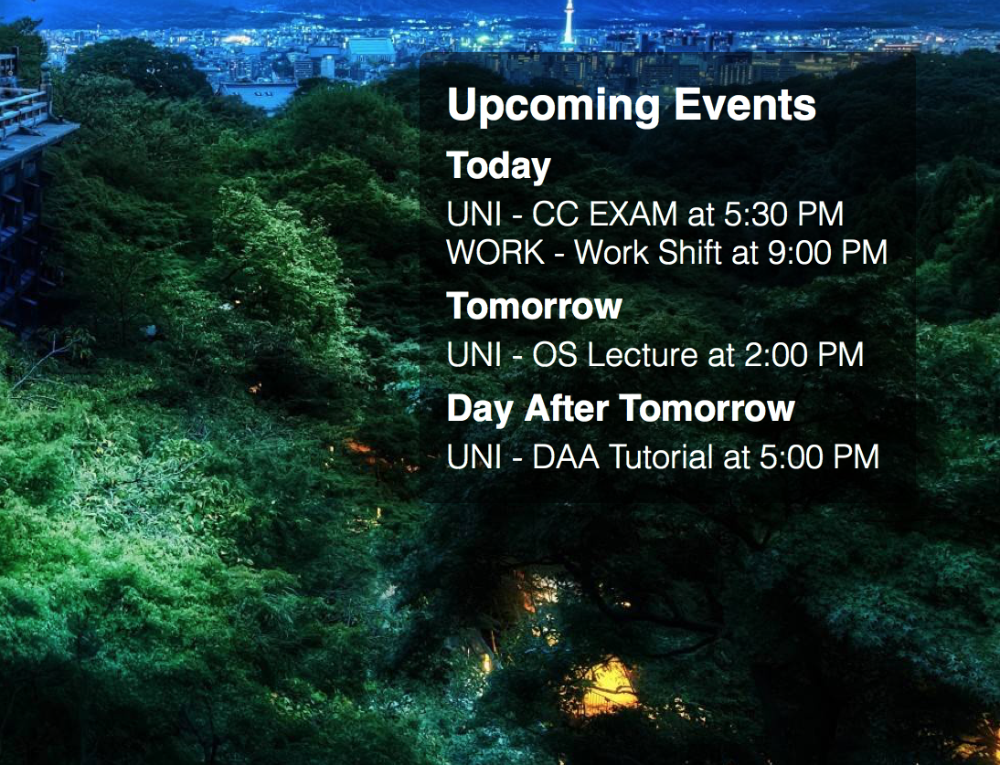

## Upcoming iCal Events

A widget made for [Übersicht](http://tracesof.net/uebersicht/) using *CoffeeScript*, syncs upcoming events from your iCalendar  



## Installation

The [iCalBuddy](http://hasseg.org/icalBuddy/) command-line utility tool **must** be installed to run. iCalBuddy can be installed by clicking the *install.command* script OR via *brew* in the terminal:

```
brew install ical-buddy
```

## Options

There are a number of options making the widget more *customizable*. Modify these values in the *main.coffee* file:

```coffeescript
# Show which calendar you pulled from before event name
SHOW_CALENDER = false
# Ignore specific calendars
IGNORE_CALENDER = [ 'calendar name' ]
# Show full date including time
SHOW_DATE_TIME = true
# Characters after this value will be replaced with ...
MAX_CHARACTERS = 50
```

## Support

- Please email me for bug fixes at *connor.beardsmore@gmail.com*
- Or open an Issue on *github*

## Credits

- Entire widget is built around the [icalBuddy](http://hasseg.org/icalBuddy/) utility developed by [Ali Rantakari](https://github.com/ali-rantakari)  
- Styling is based to match the [Countdown-Widget](https://github.com/anuragbakshi/Countdown-Widget/tree/8619663c8da9827064369c9990a9c110afa8911c) developed by [Anurag Bakshi](https://github.com/anuragbakshi)
